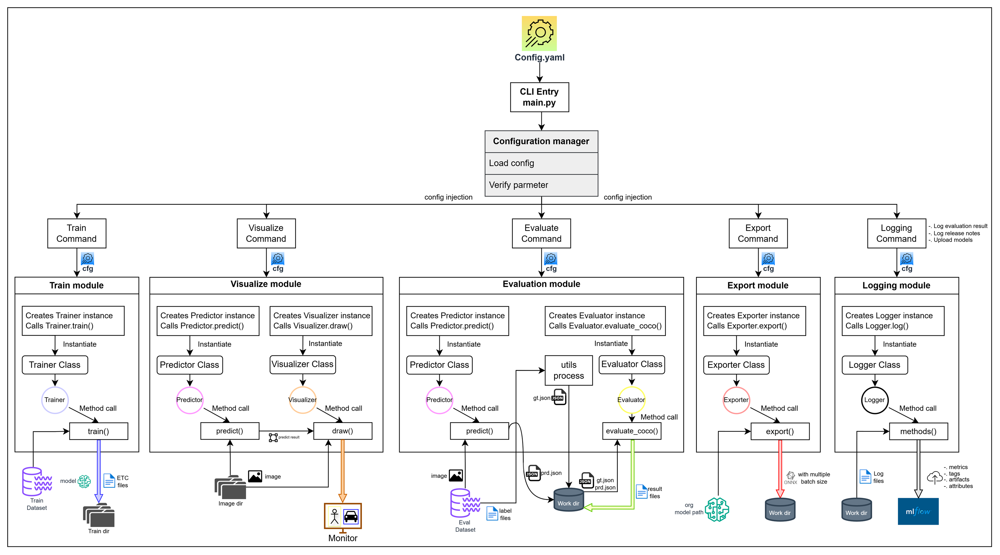
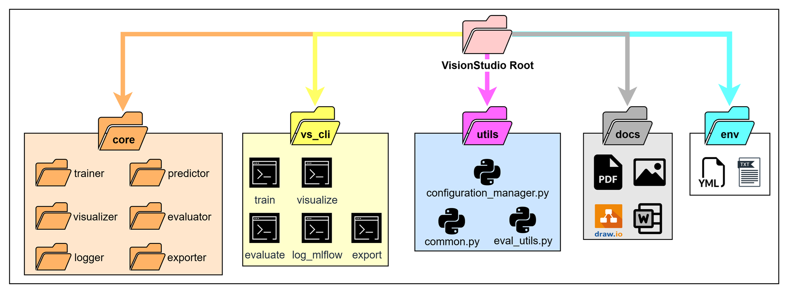

<div align="center">
  
</div>

**VisionStudio is CLI-based platform that provides integrated management of Vision AI model training, evaluation, visualization, deployment(export), and experiment tracking(MLflow).**  
VisionStudio was designed with various framework extension in mind, starting with Ultralytics(YOLO).


# 🧠 Overview
VisionStudio = Training + Evaluation + Visualization + Export + Tracking  


# 🏗️ Architecture
<div align="left">
  
</div>

VisionStudio follows a config-driven, CLI-based architecture where each command dynamically  

# 🚀 Features  
• CLI-based integrated workflow  
• MLflow-based experiment management  
• ONNX export (fixed batch / multi-batch support)  
• Framework-independent architecture  
• Release Note and Model Management Features  


# 📁 Directory Structure  
<div align="left">
  
</div>

``` diff
• core    : Training, Inference, Evaluation, Export, Logging core modules  
• vs_cli  : CLI command entry points  
• utils   : Common utility functions  
• docs    : Documentation and architecture design  
• env     : Environment setup files  
```

# ⚙️ Installation  
Modify the environment name and prefix in the environment.yml file  

``` diff
conda env create --file environment.yml  
conda activate "your VS environment"

pip install -r requirements.txt  
```

# 🧠 CLI Usage  
``` diff
python main.py --help  
```

# 📌 Commands  

| Command      | Description                       |
| ------------ | --------------------------------- |
| train        | Train model                       |
| evaluate     | Evaluate model                    |
| visualize    | Visualize result                  |
| export       | Export ONNX                       |
| log_eval     | Log evaluation result to MLflow   |
| log_release  | Log model release notes to MLflow |
| upload_model | Upload model to MLflow            |


# 🔥 1. Train  
``` diff
</> Bash  
python main.py train train.yaml  
```

**config.yaml**  
``` diff
</> YAML  
framework: ultralytics  

model: base_models/yolo/yolo11n.pt  
dataset: test/data.yaml  

epochs: 50  
imgsz: 640  
batch: 4  

project_dir: outputs/project_vision_01   
proejct_name: exp01   
```

**Output**  
``` diff
outputs/train/exp01/  
 ├ weights/  
 │   ├ best.pt  
 │   └ last.pt  
 ├ results.png  
 ├ args.yaml  
 └ other files ...  
```

# 🔥 2. Evaluate  
``` diff
</> Bash  
python main.py evaluate eval.yaml  
```

**config.yaml**  
``` diff
</> YAML  
image_dir: test/images/val  
label_dir: test/labels/val  
class_file: test/class_names.txt  

framework: ultralytics  
  
model_path: outputs/project_vision_01/exp01/weights/best.pt  
nc: 1  
task: detection  

img_sz: 640  
conf_threshold: 0.001  
nms_threshold: 0.6  
dst_dir: outputs/project_vision_01/exp01/weights/best.pt  
result_name: evaluation_result
```

**Output**  
```diff
evaluation_result.txt  
evaluation_result.json
coco format GT, PREDICT files (.json)  
in evaluation work directory  
```

# 🔥 3. Visualize  
``` diff
</> Bash  
python main.py evaluate eval.yaml  
```

**config.yaml**
```diff
</> YAML  
framework: ultralytics  
model_path: outputs/project_vision_01/exp01/weights/best.pt  
nc: 1  
task: detection  
img_sz: 640  
conf_threshold: 0.5  
nms_threshold: 0.3  
```

**Output**  
``` diff
Infrence result Display  
```

Example image ...  

# 🔥 4. Export (ONNX)  
``` diff
</> Bash
python main.py export export.yaml
```
**config.yaml**  
``` diff
framework: ultralytics  
model_path: outputs/project_vision_01/exp01/weights/best.pt  

img_sz:640  
batch: [1, 4, 8, 16, ...]  
opset: 12  

export_dir: outputs/project_vision_01/exp01/weights  
```
**Output**  
```diff
model_bsz{batch_size}.onnx  
 -> model_bsz1.onnx   
 -> model_bsz16.onnx
 ->  ...
```

# 🔥 5. MLflow Logging  
``` diff
</> Bash
python main.py log_eval logging.yaml
```

**Features**  
• Automatic recording of evaluation results  
• Dataset-based run management  

**Output**  
```diff
Evaluation result metrics in MLflow UI
```

# 🔥 6. Release Note  
``` diff
</> Bash
python main.py log_release logging.yaml
```

**Output**  
``` diff
artifacts/release_note/RELEASE.md
```

# 🔥 7. Model Upload  
``` diff
</> Bash
python main.py upload_model logging.yaml
```

**config.yaml**  
``` diff
tracking_uri: http://{mlflow_server_ip}:{mlflow_server_port}  

experiment_name: {Your experiment name}  
run_name: {Your run name}  
eval_ds_key: {Your evaluation datset key}  
work_dir: outputs/project_vision_01/exp01  
result_name: {Your evaluation result file name without extension}  
cfg_file_name: {Your train configuration file name}  
cfg_file_ext: {Your train configuration file extension}  

release:  
  date: {model released date}  
  notes:  
    - Note Sentence 1  
    - Note Sentence 2  
    - Note Sentence N    

  author: FODICS  

model_artifacts:  
  - outputs/project_vision_01/exp01/weights/best.pt  
  - outputs/project_vision_01/exp01/weights/model_bsz1.onnx  
  - outputs/project_vision_01/exp01/weights/model_bsz16.onnx  
```

# 🧪 MLflow Structure  
``` diff
Experiment
 └ Run
     ├ attributes
     ├ metrics
     ├ artifacts/
     │    ├ train_config
     │    ├ model
     │    └ release_note/
     └ tags
```

# ⚡ Pipeline Automation
``` diff
1. run_train.bat  
2. run_eval.bat  
3. run_log_eval.bat  
4. run_log_release-note.bat  
5. run_upload_models.bat  

6. run_all.bat        # train, evaluation, log-eval  
7. run_train_eval.bat # train, evaluation  
8. run_eval_log.bat   # evaluation, log-eval
```

# 🧩 Extensibility  
VisionStudio considers the following framework extensions:  
• Ultralytics (YOLO) ✅  
• RF-DETR (Planned)  
• Detectron2 (Planned)  
• MMDetection (Planned)  

# 📌 Design Philosophy  
``` diff
The frameworks are different,  
but ther results are managed identically.
```

# 🙌 Conclusion  
VisionStudio aims to be an integrated expreiment management platform for Vision AI model development.