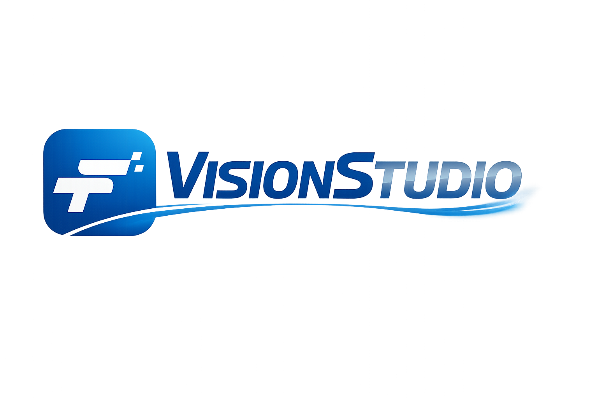

  

**VisionStudio is a modular computer vision experimentation platform designed for efficient model development and evaluation.

The platform provides a unified interface for training, inference visualization, and performance evaluation of vision models while integrating experiment tracking through MLflow.

VisionStudio currently supports multiple detection frameworks including Ultralytics YOLO and RF-DETR, and is designed to be easily extensible to additional vision models and tasks.

Key features include:

• Model training with multiple frameworks  
• Detection result visualization  
• COCO API based evaluation  
• MLflow experiment tracking  
• Modular and extensible architecture

Planned Features

• Support for additional models (Detectron2, MMDetection)  
• Segmentation and pose support  
• Dataset management tools  
• Web-based result viewer  
• Auto-labeling pipeline  